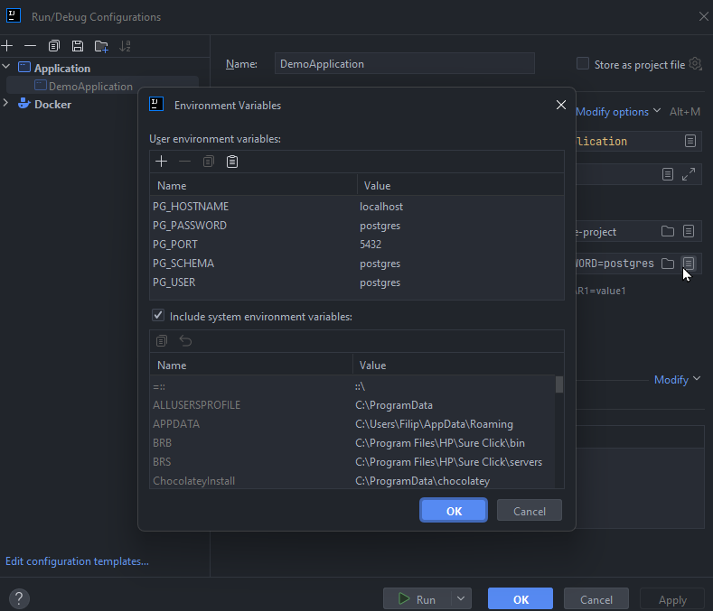

## Documentation

## Scope
- simple REST API application for creating, reading, listing, deleting users and assigning policies to them
- Spring Web, JPA
- PostgreSQL DB running as a Docker container

## Out of scope (due to time limits)
- CRUD for policies
- user updates 
- necessary data was laded into the system via liquibase scripts
- documenting endpoints in Swagger/Open API 
- tests

## How to run
- run Docker container specified in docker.compose.yml in project
- set up environment variables for the application 
- 
- run Spring Application
- test endpoints:

POST http://localhost:8080/users
```
{
"name": "jdoe",
"firstName": "John",
"lastName": "Doe",
"emailAddress": "jdoe@evolveum.com",
"organizationUnit": [
    "Software Development",
    "Support"
],
"birthDate": "2007-09-07",
"registeredOn": "2024-05-07"
}
```

GET http://localhost:8080/users/[USERID]

GET http://localhost:8080/users

PUT http://localhost:8080/users/[USERID]/assignPolicy/internal-user

_Note_: policies and organization units are to be found in the DB after running the application
